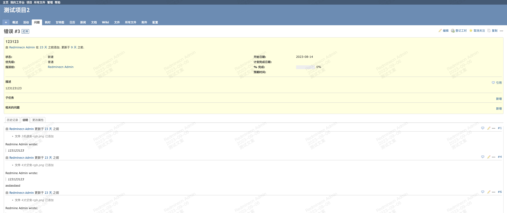

# Redmine Watermark Plugin

## Description
Add watermark to Redmine web page

## Compatible
Redmine Watermark is compatible and tested with Redmine 5.0.x, 4.2.x, 4.1.x, 4.0.x

## Installation
1. Copy the plugin directory into the plugins directory
2. Restart Redmine

## Features
  * Support current date
  * Support current user name
  * Support custom watermark text

## Showcase

